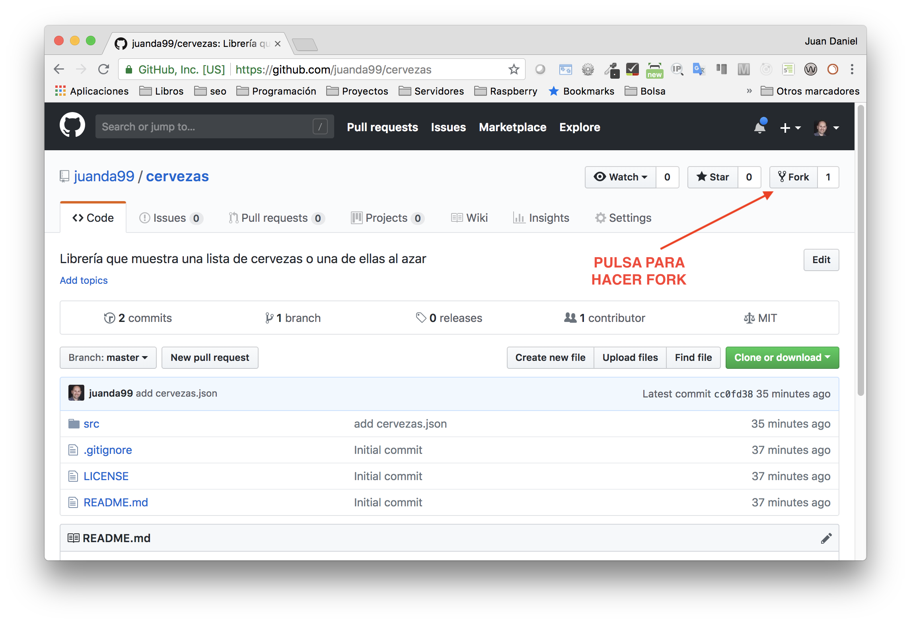
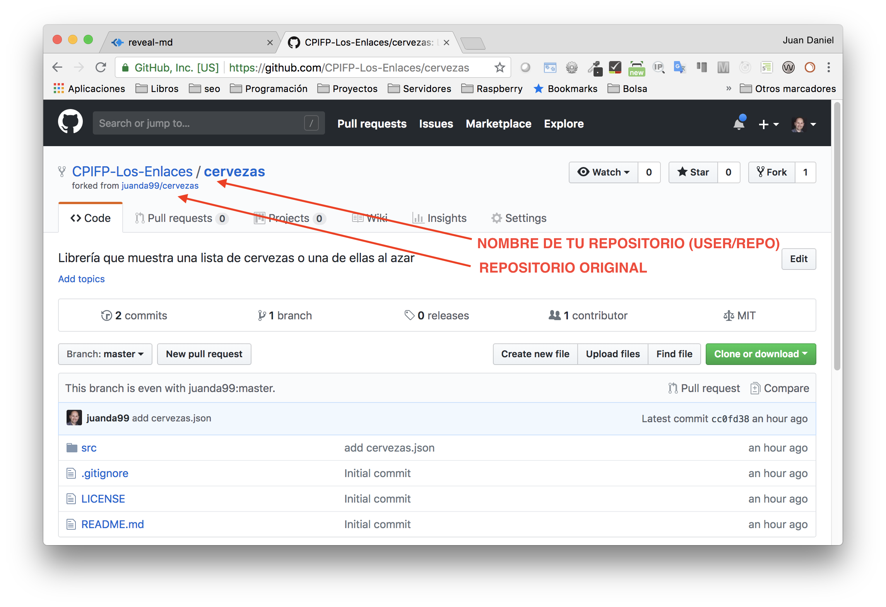
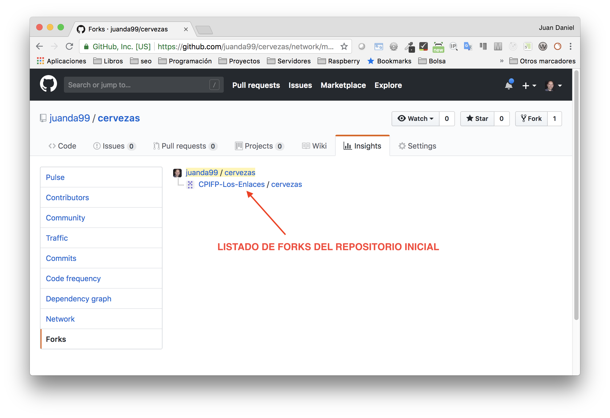
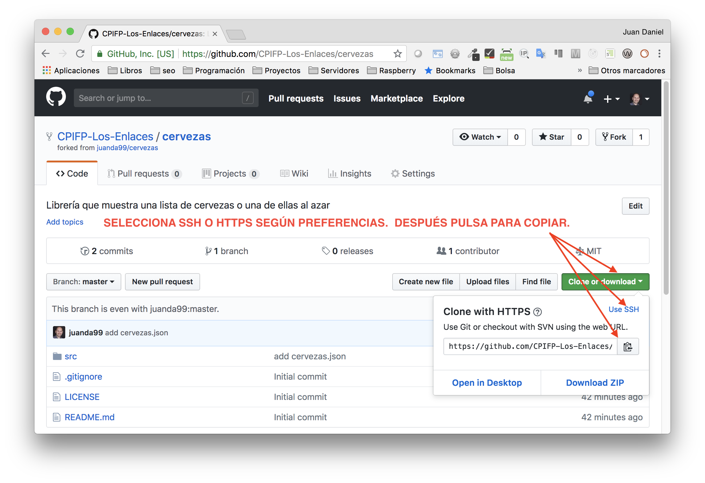
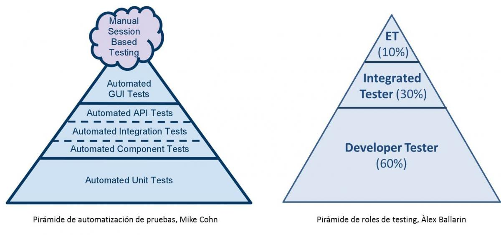
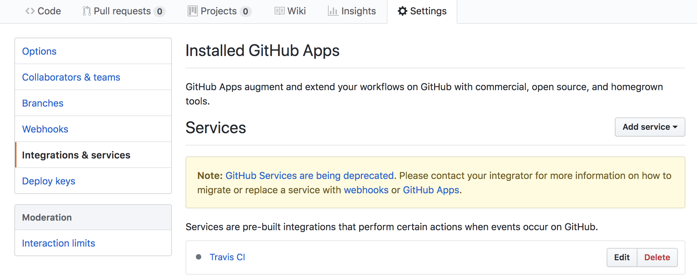

# Proyecto 3: Crear una librería

## Tiempo estimado: 150 minutos


## Funcionalidad librería

- Dada un listado de cervezas (fichero json):
  - Obtiene una marca de cerveza y sus características
  - Obtiene una o varias marcas de cerveza al azar.


## Objetivos

- Ayuda a tener claro el concepto de paquetes de Node
- Ciclo de desarrollo de un proyecto en Node.js
  - GitHub y versiones
  - Linters
  - Publicación en npm
- Repaso de todo lo visto anteriormente


## Microlibrerías

- Las librerías en Node.js suelen ser pequeñas
- A menudo se usan varias combinadas
- Lo mismo sucede con los microservicios
- Se sigue la línea de la programación funcional


- Ventajas
  - Poco código, se entiende y modifica con facilidad
  - Reusable
  - Fácil hacer tests


- Desventajas
  - Tienes que gestionar muchas dependencias
  - Control de versiones de todas ellas
    - Utilizamos [semantic versioning](https://docs.npmjs.com/getting-started/semantic-versioning)
    - Fichero *package-lock.json* para instantánea de versiones de nuestras librerías


## Control de versiones

- Utilizaremos git como control de versiones de nuestro proyecto
- Utilizaremos [GitHub](https://github.com/) como servidor git en la nube
  - Crea un usuario en [GitHub](https://github.com/)  si no lo tienes
  - [Comprueba que tengas git correctamente configurado](http://localhost:1948/configuracion-inicial.md#/3/11):
    ```bash
    git config --list
    ```
  - Exporta tu clave pública ssh a GitHub si vas a usar ssh para hacer el sync de repositorios


## npm

- Es el gestor de paquetes de node:
  - Podemos buscar librerías para usar
  - Podemos publicar nuestra propia librería :-)
- Debemos [crear un usuario en npm](https://www.npmjs.com/)


## Configuración de npm

- Cuando creemos un nuevo proyecto nos interesa que genere automaticamente datos como nuestro nombre o email
- Ver [documentación para su configuación](https://docs.npmjs.com/) o mediante consola:
  - *npm config --help* para ver los comandos de configuración


```bash
npm set init-author-name pepe
npm set init-author-email pepe@pepe.com
npm set init-author-url http://pepe.com
npm set init-license MIT
npm adduser
```

- Los cambios se guardan en el fichero $HOME/.npmrc
- *npm adduser* genera un authtoken = login automático al publicar en el registro de npm


## Versiones en node

- Se utiliza [Semantic Versioning](http://semver.org/)
- Formato versiones: ***major.minor.patch***
  - **major**: Cambios en compatibilidad de API
  - **minor**: Añade funcionalidad. Mantiene compatibilidad.
  - **patch**: Soluciona bug. Mantiene compatibilidad.
- ¡Puede obligarnos a cambiar el **major** muy a menudo!


## ¿Cómo trabajo?

- Antes era práctica habitual:

  ```bash
  npm set save-exact true
  ```

- Ahora con package-lock.json no es necesario
- Esta novedad la trajo **yarn**, otro gestor de paquetes.


## Empezamos proyecto


## Crear repositorio en GitHub

- Realizamos un [fork de mi proyecto](https://github.com/juanda99/cervezas)
  - Así tendremos el fichero para la práctica
  - .gitignore correctamente configurado
  - Puedo hacer seguimiento de vuestros desarrollos











## Clonar repositorio a local

```bash
git clone <url proyecto>
```

- La url la copiamos del repo de GitHub (ver captura)
  - ssh normalmente en linux (necesitas importar la clave pública a GitHub)
  - https normalmente en windows / mac





## Crear proyecto

```bash
  cd <url proyecto>
  npm init
```

- package_name debe ser único: **no puede haber dos proyectos con el mismo nombre en npm**
  - Es aconsejable que el nombre del repo sea igual al de la librería
- El *entry-point* lo pondremos en *src/index.js*, así separaremos nuesto código fuente de los tests
- El resto de parámetros con sus valores por defecto
- ¡Ya tenemos nuestro **package.json** creado!


## Listar todas las cervezas

- Editamos nuestro fichero *src/index.js*

```js
const cervezas = require('./cervezas.json');
module.exports = {
  todas: cervezas
};
```

- Abrimos una consola y comprobamos que funcione nuestra librería:

```js
node
> const cervezas = require('./index.js')
undefined
> cervezas.todas
```


## Estilo de código

- Puede que colabore más gente en nuestra librería
  - Queremos un estilo uniforme
- Y si nos detecta fallos mejor

- Instalaremos eslint (*D* o *--save-dev*)

  ```js
  npm i -D eslint
  ```


## Configuración de eslint

```bash
$ node_modules/.bin/eslint --init # o npx eslint --init
? How would you like to configure ESLint? 
  Use a popular style guide
? Which style guide do you want to follow? 
  Standard
? What format do you want your config file to be in? 
  JSON
? Would you like to install them now with npm? 
  Yes
```


## Análisis configuración

- Debemos cambiar nuestro código de src/index.js
- *.eslintrc.json* tiene la configuración de nuestro linter
- [Podríamos modificarla](https://eslint.org/docs/rules/), por ej:

```json
{
    "extends": "standard",
    "rules": {
        "prefer-const": "error",
        "no-var": "error"
    }
}
```

- Ayuda: Pulsa *CTRL + espacio* para autocompletado


## Modificaciones Visual Code Editor

- Prettier debe basarse en el fichero eslintrc
- Modificaciones de eslint al guardar
- Visual Code da sugerencias por ejemplo para cambiar el tipo de módulos de Node.JS (CommonJs, síncrono) a ES6 Modules (asíncrono). 
  - [No nos interesan](https://nodejs.org/api/esm.html)


- Cambiamos las preferencias en Visual Code Editor para formatear nuestro JavaScript:

```json
  "prettier.eslintIntegration": true,
  "eslint.autoFixOnSave": true, //podríamos usar prettier-eslint
  "javascript.suggestionActions.enabled": false
```


- Observa que prettier tiene unas configuraciones por defecto:

  ```json
    // Whether to add a semicolon at the end of every line
    "prettier.semi": true,

    // If true, will use single instead of double quotes
    "prettier.singleQuote": false,
  ```

- Debemos quedarnos con lo que se define en eslint, que es más parametrizable.
- [Configuración sin Visual Code Editor](https://prettier.io/docs/en/eslint.html)


## Obtener una cerveza al azar

- Instalamos el paquete [uniqueRandomArray](https://www.npmjs.com/package/unique-random-array)

```bash
npm i -S unique-random-array
```

- Configuramos nuestro fuente:

```js
const cervezas = require('./cervezas.json')
const uniqueRandomArray = require('unique-random-array')
module.exports = {
  todas: cervezas,
  alazar: uniqueRandomArray(cervezas)
}
```

- Comprobamos que funcione. Ojo, ¡alazar es una función!


## Subir a GitHub

- **.gitignore** no sincroniza **node_modules**:

  ```bash
  $ du -sh node_modules
  43M	node_modules
  ```

- Subir a GitHub ( o desde el editor de código):

  ```bash
  git status # node_module no debería estar
  git add -A
  git status
  git commit -m "versión inicial"
  git push
  ```

- Comprobamos desde GitHub.


## Publicar en npm

- Mediante consola:

  ```bash
  npm publish
  ```

- Podemos comprobar la información que tiene npm de cualquier paquete mediante

  ```bash
  npm info <nombre paquete>
  ```


## Probar librería

- Creamos un nuevo proyecto e instalamos nuestra librería
- Creamos un index para utilizarla:

```js
var cervezas = require('cervezas')
console.log(cervezas.alazar())
console.log(cervezas.todas)
```

- Ejecutamos nuestro fichero:

```bash
node index.js
```


## Versiones en GitHub

- Nuestro paquete tiene la versión 1.0.0 en npm
- Nuestro paquete no tiene versión en GitHub, lo haremos mediante el uso de etiquetas:

```bash
git tag v1.0.0
git push --tags
```

- Comprobamos ahora que aparece en la opción Releases y que la podemos modificar.
- También aparece en el botón de seleccionar branch, pulsando luego en la pestaña de tags.


## Lodash

- El jQuery de node, una navaja suiza
  - Es modular (menor tamaño), en una aplicación en servidor da igual
  - [En un SPA instalaríamos el módulo/s que necesitásemos](https://www.npmjs.com/search?q=keywords:lodash-modularized)
- Es uno de los [paquetes más descargados](https://www.npmjs.com/package/lodash) de npm
- [Ver documentación](https://lodash.com/docs/)


## Modificar librería

- Queremos mostrar las cervezas ordenadas por nombre
- Utilizaremos la **librería lodash** (navaja suiza del js):

```js
var cervezas = require('./cervezas.json')
var uniqueRandomArray = require('unique-random-array')
var _ = require('lodash')
module.exports = {
  todas: _.sortBy(cervezas, ['nombre']),
  alazar: uniqueRandomArray(cervezas)
}
```


## Actualizar repos

- Hemos hecho un cambio **minor**. Tenemos que:
  - Cambiar la versión a 1.1.0 (semver) de nuestro proyecto (*package.json*)
  - Publicar el paquete de nuevo

    ```bash
    npm publish
    ```

  - Añadir la etiqueta en GitHub

  ```bash
  git add -A
  git status
  git commit -m "listado cervezas ordenadas por nombre"
  git tag v1.1.0
  git push && git push --tags
  ```


## Versiones beta

- Vamos a añadir una cerveza nueva, pero todavía no se está vendiendo.
- Aumentamos nuestra versión a 1.2.0-beta.0 (nueva funcionalidad, pero en beta)
- Al subirlo a npm:

  ```bash
  npm publish --tag beta
  ```


- Con npm info podremos ver un listado de nuestras versiones (¡mirá las dist-tags)
- Para instalar la versión beta:

  ```bash
  npm install <nombre paquete>@beta
  ```


## Tests


## Tipos de tests




## Enfoque de nuestros tests unitarios

- Utilizaremos BDD (behaviour driven development)
  - TDD (test driven development)
  - Más legibles (mayor descripción)

- Unit Testing te informa de **qué funciona**
- Test-Driven Development te informa de **cuándo funciona**
- Behavior Driven-Development te dice **cómo funciona**


## Librería de tests

- Utilizaremos [**Mocha**](https://mochajs.org/) como librería de tests
  - Es la más extendida
  - Últimamente se utiliza mucho también **jest** (más en frontend)
- Utilizaremos [Chai](http://www.chaijs.com/) como assertion library
  - Mocha permite utilizar la librería de aserciones que queramos


## Estructura de los tests

- Se utiliza **describe** para definir conjuntos de tests
  - Es un simple método de agrupación
  - Se pueden anidar
- Se utiliza **it** para cada uno de los tests

```js
describe('Sistema Solar', function(){
  describe('Tierra', function(){
    describe('España', function(){
      it('Se habla castellano', function(){ /** ... */ })
      it('Se conduce por la derecha', function(){ /** ... */ })
    })
    describe('Francia', function(){
      it('Se habla francés', function(){ /** ... */ })
      ...
    })
  })
})
```


## Ejemplo de test

```js
const utils = require('./utils')

it('Debería sumar dos números', () => {
  var res = utils.add(3, 4)

  if (res !== 7) {
    throw new Error(`Resultado esperado 44, pero se ha recibido: ${res}.`)
  }
})
```


## Librerías de Visual Studio Code

- [Para autocompletado de código de Mocha](https://marketplace.visualstudio.com/items?itemName=spoonscen.es6-mocha-snippets)
- Para [comprobar el estado de nuestros tests y/o monitorización](https://marketplace.visualstudio.com/items?itemName=maty.vscode-mocha-sidebar)
  - Es habitual hacerlo dentro del package.json (**mocha -w**)
  - Utiliza la preferencia *mocha.files.glob* para buscar los tests


## Aserciones

- Hay varios estilos.
  - expect / should siguen el estilo BDD
  - assert sigue el estilo TDD

```js
var assert = require('assert')
var expect = require('chai').expect
var should = require('chai').should()
```

- Nosotros utilizaremos expect:

```js
it('Se habla castellano', function(){
  expect(language).to.equal('spanish')
})
```


## Ejemplo aserciones

- La propia librería muestra los mensajes de error
- Permite encadenar comprobaciones

```js
const utils = require('./utils')

it('Debería sumar dos números', () => {
  expect(utils.sum(3,4)).to.equal(7)
  // otra opción: expect(utils.sum(3,4)).to.equal(7).to.be.a('number')
})
```


## Instalación librerías tests

- Las instalaremos como dependencias de desarrollo:

  ```bash
  npm i -D mocha chai
  ```

- Añadimos el comando para test en el package.json (-w para que observe):

  ```bash
  "test": "mocha test/index.test.js -w"
  ```


- Creamos un fichero *test/index.test.js* con las pruebas

```js
/* global describe it */
const expect = require('chai').expect
describe('cervezas', () => {
  it('should work!', () => {
    return expect(true).to.be.true
  })
})
```


- Ahora prepararemos una estructura de tests algo más elaborada:

```js
/* global describe it */
const expect = require('chai').expect
const cervezas = require('../src/index')

describe('cervezas', () => {
  describe('La lista de todas', () => {
    it('Debería ser un array de objetos', () => {
      // utiliza el método Array.prototype.every()
    })
    it('Debería incluir la cerveza Ambar', () => {
      // utiliza el método Array.prototype.some()
    })
  })
  describe('Elegir una cerveza al azar', () => {
    it('Debería mostrar un elemento de la lista de cervezas', () => {

    })
  })
})
```


- Por último realizamos los tests:

```js
/* global describe it */
const expect = require('chai').expect
const cervezas = require('../src/index')

describe('Cervezas', () => {
  describe('La lista de todas', () => {
    it('Debería ser un array de objetos', () => {
      expect(cervezas.todas).to.satisfy(isArrayOfObjects)
    })
    it('Debería incluir la cerveza Ambar', () => {
      expect(cervezas.todas).to.satisfy(contieneAmbar)
    })
  })
  describe('Elegir una cerveza al azar', () => {
    it('Debería mostrar un elemento de la lista de cervezas', () => {
      const cerveza = cervezas.alazar()
      expect(cervezas.todas).to.include(cerveza)
    })
  })
})

const isArrayOfObjects = array => {
  return array.every(item => {
    return typeof item === 'object'
  })
}

const contieneAmbar = array => array.some(
  (cerveza) => cerveza.nombre === 'ÁMBAR ESPECIAL'
)

```


## Desarrollo nuevas versiones

- El proceso de desarrollo siguiendo BDD/TDD es el siguiente:
  - Se crean los tests
  - Se ejecutan (monitorizan)
  - Se añade el código hasta que los tests están en verde


## Lista de tareas

- Una vez que los tests funcionan:
  - Se cambia la versión en package.json
  - Se realiza el commit y push a GitHub
  - Se publica en npm
  - Push de los tags a GitHub


## Automatización de tareas

- Queremos que al hacer el push a GitHub:
  - Se calcule la nueva versión de forma automática
  - Se pongan los tags en GitHub
  - Se publique en npm la nueva versión


## Calcular la nueva versión

- Mediante el paquete **Semantic Release**
  - ¿Y cómo sabe que versión corresponde?
    - Mediante un mensaje de commit apropiado.

- ¿Cómo realizamos los mensajes de commit?
  - [Según doc de semantic-release](https://github.com/semantic-release/semantic-release)
  - Usa las [Angular Commit Message Conventions](https://github.com/angular/angular.js/blob/master/DEVELOPERS.md#-git-commit-guidelines)
- El paquete **commitizen** que nos ayudará en la generación de los mensajes de los commit


## WorkFlow

- Asociamos nuestro repositorio en GitHub a un CI
  - **Travis** como CI (continuous integration)
- Realizamos commit de nuestra librería usando comitizen
- Travis se dispara cuando se hace el push a GitHub y ejecuta semantic release
  - Semantic release en función del mensaje del commit:
    - Calcula la versión que corresponde
    - Publica release en GitHub
    - Publica en npm


## Instalación Semantic Release

- Instalación y configuración:

```bash
 npx semantic-release-cli setup
? What is your npm registry? https://registry.npmjs.org/
? What is your npm username? juanda
? What is your npm password? [hidden]
? What is your GitHub username? juanda99
? What is your GitHub password? [hidden]
? What CI are you using? Travis CI
? Do you want a `.travis.yml` file with semantic-release setup? Yes
```


- **.travis.yml**: contiene la configuración de Travis
```
after_success:
  - npm run travis-deploy-once "npm run semantic-release"
```

- Se ejecuta el comando *npm run semantic-release* una sola vez
  - No una por cada versión de node
  - Gracias al *travis-deploy-once*


- Cambios en package.json:
  - Modifica versión (la gestionará semantic-release de forma interna)
  - Incluye dos nuevos scripts y sus dependencias de desarrollo

```bash
"travis-deploy-once": "travis-deploy-once",
"semantic-release": "semantic-release"
```

  


## Configuración de Travis

- Semantic Release se ejecuta a través de Travis CI
  - No queremos que se ejecuten si no se pasan los tests
  - Modificamos travis.yml:

```yaml
...
script:
  - npm test
after_success:
- npm run travis-deploy-once "npm run semantic-release"
...
```


- Activamos desde la [web de Travis](https://travis-ci.org/) nuestro repositorio
- En el repositorio dentro de GitHub aparecerá un nuevo servicio:



## Uso de commitizen

- La instalación, siguiendo su [documentación](https://www.npmjs.com/package/commitizen):

  ```bash
  npm i -D commitizen
  npx commitizen init cz-conventional-changelog -D
  ```

- Configuraremos un npm script para los commits:

```json
"scripts": {
  ......,
  "commit": "git-cz"
}
```


## Cambio de versión

- Vamos a comprobar nuestro entorno añadiendo una funcionalidad
- Si pedimos cervezas.alazar() queremos poder recibir más de una
- Los tests:

  ```js
  it('Debería mostrar varias cervezas de la lista', () => {
    const misCervezas = cervezas.alazar(3)
    expect(misCervezas).to.have.length(3)
    misCervezas.forEach((cerveza) => {
      expect(cervezas.todas).to.include(cerveza)
    })
  })
  ```


- Añadimos la funcionalidad en el *src/index.js*:

```js
var cervezas = require('./cervezas.json');
var uniqueRandomArray = require('unique-random-array');
var _ = require('lodash');
var getCerveza = uniqueRandomArray(cervezas)
module.exports = {
  todas: _.sortBy(cervezas, ['nombre']),
  alazar: alazar
}

function alazar(unidades) {
  if (unidades===undefined){
    return getCerveza();
  } else {
      var misCervezas = [];
      for (var i = 0; i<unidades; i++) {
        misCervezas.push(getCerveza());
      }
      return misCervezas;
  }
}
```


- Hagamos ahora el *npm run commit & git push* y veamos como funciona todo


## Git Hooks

- Son una manera de ejecutar scripts antes de que ocurra alguna acción
- Sería ideal pasar los tests antes de que se hiciera el commit
- Los Git Hooks son locales:
- Si alguien hace un clone del repositorio, no tiene los GitHooks
- Instalaremos un paquete de npm para hacer git hooks de forma universal

```bash
npm i -D ghooks
```


- Lo configuraremos en el package.json en base a la [documentación del paquete](https://www.npmjs.com/package/ghooks):

```json
"config": {
  "ghooks": {
    "pre-commit": "npm test"
  }
}
```


## Coverage

- Nos interesa que todo nuestro código se pruebe mediante tests.
- Necesitamos una herramienta que compruebe el código mientras se realizan los tests:

```bash
npm i -D instanbul
```

- Modificaremos el script de tests en el package.json:

```bash
istanbul cover -x *.test.js _mocha -- -R spec src/index.test.js
```


- Instanbul analizará la cobertura de todos los ficheros excepto los de test ejecutando a su vez _mocha (un wrapper de mocha proporcionado por ellos) con los tests.
- Si ejecutamos ahora *npm test* nos ofrecerá un resumen de la cobertura de nuestros tests.
- Por último nos crea una carpeta en el proyecto *coverage* donde podemos ver los datos, por ejemplo desde un navegador (fichero index.html)
- ¡Ojo, recordar poner la carpeta coverage en el .gitignore!


## Check coverage

- Podemos también evitar los commits si no hay un porcentaje de tests óptimo:

  ```json
  "pre-commit": "npm test && npm run check-coverage"
  ```

- Creamos el script check-coverage dentro del package.json:

  ```json
  "check-coverage": "istanbul check-coverage --statements 100 --branches 100 --functions 100 --lines 100"
  ```


- Podemos comprobar su ejecución desde el terminal mediante *npm run check-coverage* y añadir una función nueva sin tests, para comprobar que el check-coverage no termina con éxito.
- Lo podemos añadir también en Travis, de modo que no se haga una nueva release si no hay ciertos estándares (el test si lo hace por defecto):

  ```yml
  script:
  - npm run test
  - npm run check-coverage
  ```


## Gráficas

- Utilizaremos la herramienta codecov.io:

  ```bash
  npm i -D codecov.io
  ```

- Crearemos un script que recoge los datos de istanbul:

  ```json
  "report-coverage": "cat ./coverage/lcov.info | codecov"
  ```


- Lo añadimos en travis de modo que genere un reporte:

  ```yml
  after success:
  - npm run report-coverage
  - npm run semantic-release
  ```

- Integrado con github (chrome extension)
- Por último podemos añadir etiquetas de muchos servicios: npm, codecov, travis... una fuente habitual es http://www.shields.io

