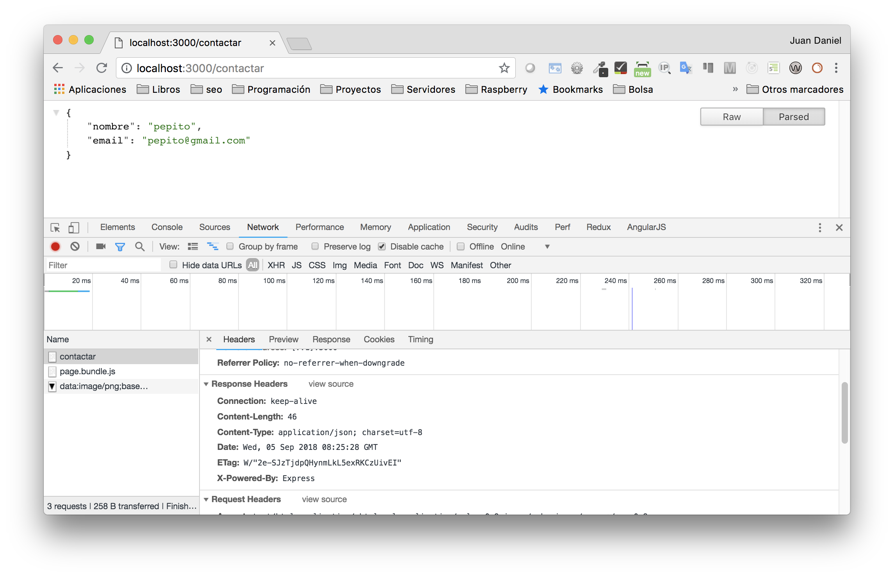

# Proyecto 5: Servidor web mediante Express

## Tiempo estimado: 60 minutos


## Descripción

- *Montar un servidor web mediante paquetes propios de node*


## Objetivos

- Entender la arquitectura de Express
  - Middleware
  - Uso de paquetes para extender la funcionalidad de Express
- Creación de un servidor web que sirva:
  - Contenido estático
  - Contenido dinámico en base a templates
  - Content-type en JSON (para API posterior)
- Despliegue del servidor en un entorno serverless


## Empezamos proyecto


## Documentación

- https://expressjs.com/
  - Extensa pero consisa
  - Numerosos ejemplos


## Primeros pasos

- No utilizaré ningún repo de GitHub.
- Creamos un directorio para la app y...
  - npm init
  - Instalar y configurar eslint (standard)


## express

- Instalar express mediante uno de los comandos siguientes:

  ```bash
  npm install --save express@4.16.3
  npm i -S express@4.16.3
  ```

- Creamos el fichero server.js con el siguiente código:

```js
const express = require('express')
const app = express()
app.get('/', (req, res) => {
    res.send('Hola Mundo')
})
app.listen(3000)
```


## Ejecución

- Debería ejecutarse de cualquiera de las siguientes maneras:

```
npm start
node server.js
```

- Utiliza **nodemon** para evitar reinicios al cambiar código


## Prueba funcionamiento

- Se echa de menos algún tipo de mensaje de arranque
- [Mira en la documentación](https://expressjs.com/) como añadir esa opción
  - Cuando el método listen haya terminado...


## Método listen

- Permite añadir más parámetros
- Un parámetro de tipo función (función de callback)
  - Es el único parámetro de este tipo, así los diferencia

```js
app.listen([port[, host[, backlog]]][, callback])
```

```js
app.listen(3000, () => {
  console.log('Servidor web arrancado en el puerto 3000')
})
```


## Añadir otra ruta

- Utiliza el plugin ***ExpressSnippet*** de Visual Code para completado
  - Comprueba su funcionamiento con el ***app.listen***
- Datos nueva ruta:
  - URL: ***/contactar***
  - Muestre el mensaje ***Página para contactar***


## Código ruta contactar

```js
app.get('/contactar', (req, res) => {
    res.send('Página para contactar')
})
```


## Uso de JSON

- Vamos a devolver un JSON en vez de un string:

```js
app.get('/contactar', (req, res) => {
    res.send({
      nombre: 'pepito'
      email: 'pepito@gmail.com'
    })
})
```


## Comprobar JSON

- Utiliza algún plugin de formateo de JSON dentro del navegador
  - El JSON puede ser más complejo que el anterior, por ej:

    ```bash
    https://api.arasaac.org/api/pictograms/es/search/casa
    ```

- Comprueba como cambia el content type
  - Utiliza las herramientas de desarrollo
  - El cambio lo hace directamente Express





- Los datos en JSON podrían estar:
  - En una variable
  - Incluso en otro fichero
  - Recibirse vía API
  - ....

```js
const contacto = require('./contacto.json')
app.get('/contactar', (req, res) => {
  res.send(contacto)
})
```


## Middleware

- Son funciones que:
  - Se registran por express mediante ***app.use*** y se ejecutan en orden
  - Tienen acceso al objeto de solicitud (***req***), al objeto de respuesta (***res***) y a la siguiente función de middleware (***next***)

```js
app.use((req, res, next)=>{
  //operaciones del middleware
  next() //para ir al siguiente middleware o a la ruta
  // también podríamos hacer un send() y cortar
  // la cola de middlewares, por ej en un control de permisos
})
```


## Ejemplo de middleware

- Podemos crear un middleware que guarde traza de las fechas de accesos
- Para ver las propiedades que nos hacen falta podemos usar la [API de Express](https://expressjs.com/en/4x/api.html)
- Es importante el orden
  - Entre los middlewares
  - Antes que las peticiones get, post....


```js
var app = express()

app.use(function (req, res, next) {
  var now = new Date().toString()
  console.log(`Time: ${now} ${req.method} ${req.url}`)
  next()
})
```


## Logs a fichero

- Completa el middleware anterior para que guarde los cambios en el fichero *server.log*
- Piensa donde se debe poner el next() y si debes utilizar un método síncrono o asíncrono


## Solución logs a fichero

```js
app.use((req, res, next) => {
  var now = new Date().toString()
  var log = `${now}: ${req.method} ${req.url}`
  console.log(log)
  fs.appendFile('server.log', `${log}\n`, (err) => {
    if (err) console.log(`No se ha podido usar el fichero de log:  ${err}`)
  })
  next()
})
```


## Más sobre logs

- Podemos querer utilizar distintos *transports* o medios para logs
  - Ficheros
  - Consola
- Distintos niveles (debug, err, warning...)
- Distintos formatos de visualización (colores, negrita...)
- Con posibilidad de ejecución de queries
- ....
- Lo mejor es [usar algún paquete que ya exista](https://www.npmjs.com/package/winston)


## Uso de contenido estático

- Crea un fichero .html en la carpeta public
  - Ayúdate de emmet: *! + tab*

- Express ya tiene un middleware integrado para contenido estático
  - No deja de ser una función como las vistas anteriormente
  - No necesitamos importarla mediante un require
  - Una vez importado, hace un **send()** si existe el fichero, si no, un **next()**


## Configuración express para contenido estático

```js
const staticRoute = path.join(__dirname, 'public')
app.use(express.static(staticRoute))
```

- *__dirname* es la raíz del proyecto
- *path.join* para que sea multiplataforma

- Podríamos configurar un directorio virtual (static para public)

```js
const staticRoute = path.join(__dirname, 'public')
app.use('/static', express.static(staticRoute))
```


## Template engine

- Mostrar un index.html está bien pero puede que necesitemos:
  - Inyectar valores en el html
  - *"includes"* para footer, header... (patrón diseño DRY)

- Tenemos que elegir un motor de plantillas
  - [hbs, ejs, pug (jade)...](https://npmcompare.com/compare/ejs,handlebars,jade,mustache,pug)
  - Utilizaremos hbs que es un wrapper de [handlebars](https://handlebarsjs.com/)


## Configuración de hbs

- Instalación

  ```bash
  npm i -S hbs
  ```

- Configuración

  ```js
  // const hbs = require('hbs')
  app.set('view engine', 'hbs'); // clave valor
  ```

  - No hacemos un require porque no usamos ninguna función
  - express lo llama internamente


- Indicamos a nodemon los tipos de ficheros a monitorizar (por defecto solo js):

```json
"scripts": {
  "start": "nodemon server.js -e js,hbs"
},
```


## Uso de hbs

- Definimos una carpeta views donde irán las templates
- Fichero *views/contactar.hbs:*

```js
  ...
  <body>
    <h1>{{pageTitle}}</h1>
    <p>Aquí iría el formulario de contacto</p>

    <footer>
      <p>Copyright {{currentYear}}</p>
    </footer>
  </body>
  ....
```


- Ejecutamos el método ***res.render()*** en vez de ***res.send()***
  - Admite un objeto como segundo parámetro para pasar variables

```js
app.get('/contactar', (req, res) => {
  res.render('contactar.hbs', {
    pageTitle: 'Contactar',
    currentYear: new Date().getFullYear()
  })
})
```


## Partials mediante handlebars

- Registramos el directorio donde se van a guardar:

```js
const hbs = require('hbs')
hbs.registerPartials(path.join(__dirname, 'views', 'partials'))
app.set('view engine', 'hbs') // clave valor
```

- Creamos fichero *views/partials/footer.hbs*:

```hbs
  <footer>
    <p>Copyright {{getCurrentYear}}</p>
  </footer>
```


- Lo incluimos dentro de nuestro fichero *views/contactar.hbs*:

```hbs
  ...
  <body>
    <h1>{{pageTitle}}</h1>
    <p>Aquí iría el formulario de contacto</p>
    {{> footer}}
    <!-- con la linea anterior
       tendríamos el footer mediante partials -->

  </body>
  ....
```


## Ejercicio templates

- Añade una página de inicio además de contactar
- Ambas deben cargar su correspondiente template que además cargará un partial para el header y otro para el footer


## Uso de helpers

- Se registran funciones que devuelven un código dinámico 
- Se pueden inyectar en cualquier template o partial.

```js
hbs.registerHelper('getCurrentYear', () => new Date().getFullYear())
// con paso de parámetro:
hbs.registerHelper('toUpperCase', text => text.toUpperCase())
```

- Podríamos eliminar el paso de *currentYear* a las vistas y utilizar el helper:

```js
<footer>
  <p>Copyright {{getCurrentYear}}</p>
  <p>{{toUpperCase "Licencia MIT"}}</p>
 {{>header}}
</footer>
```


## Deploy

- Soluciones tradicionales como máquinas con Plesk, cPanel o similar no son aptas para node.js
  - Dan solución a CMS's, código en php y mySQL
- [JavaScript es el estándar de facto para soluciones serverless](https://hackernoon.com/the-serverless-series-what-is-serverless-d651fbacf3f4)
  - [Google Cloud Functions](https://cloud.google.com/functions/) por ejemplo solo funciona con JavaScript
  - Nosotros haremos el deploy usando [Zeit](https://zeit.co/)


## ¿Continuamos?

- Ya estamos preparados para utilizar express para crear una API
  - [Creación de una API](./6-api.md)
