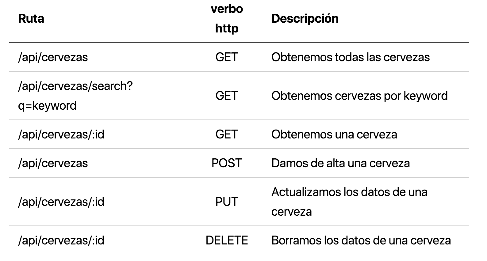
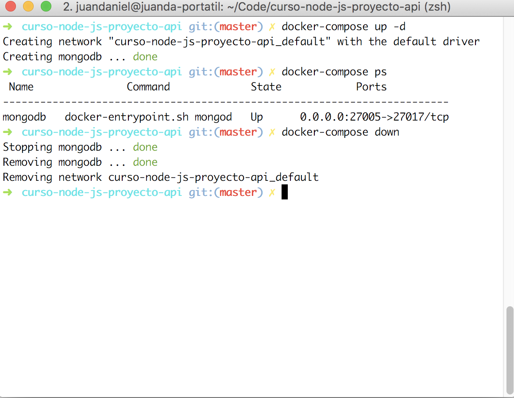
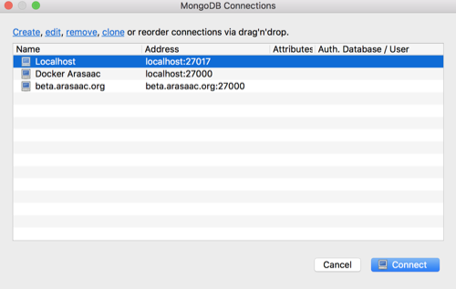
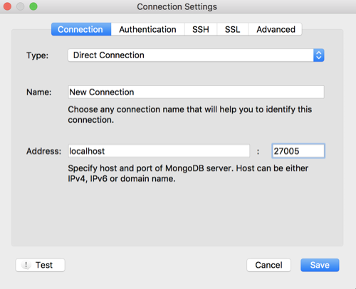
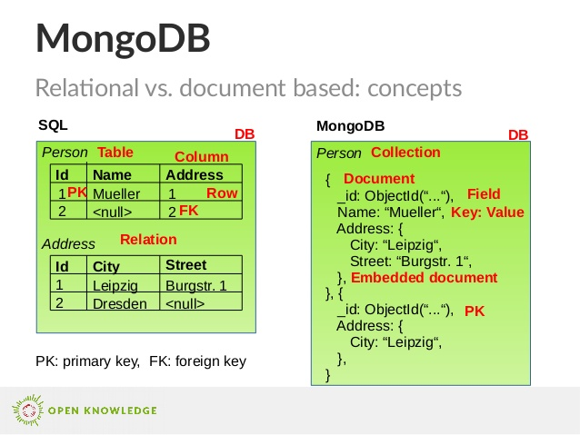

# Creación de una API

## Tiempo estimado: 150 minutos


## Descripción

- *Creación de una API REST estándar y completa que pueda clonarse para distintos proyectos*


## Objetivos

- Conocer el objeto Router de express
- Conocer arquitecturas MVC
- Familiarizarse con base de datos no relacional
- Comprender las ventajas en JavaScript de MongoDB frente a bases de datos relacionales
- Familiarizarse con el uso de contenedores (docker)


## Pasos previos

- Entender [como funciona un servidor express](./5-express.md)
- Tener claro [que es una API y una arquitectura API REST](./arquitectura-api-rest.md)


## Primeros pasos

- [Fork del repositorio en GitHub](https://github.com/juanda99/curso-node-js-proyecto-api)
- Clonar tu repositorio
- Inicializar proyecto con npm init
- Instalar y configurar eslint extendiendo de standard:

  ```bash
  npm i -D eslint@5.4.0
  node_modules/.bin/eslint --init
  ```

- Personalizar eslint utilizando el fichero *.eslintrc.json*


## Instalar paquetes y configurar npm start

- Instalamos express
  
  ```bash
  npm i -S express@4.16.3
  ```

- Configuramos package.json para que nuestro servidor arranque mediante *npm start*

  ```json
  "scripts": {
    "start": "node app/server.js"
  },
  ```


## [Postman](https://www.getpostman.com/)

- Utilizaremos [Postman](https://www.getpostman.com/) para testear nuestra API
  - Independiente de que hagamos tests por otro lado
- Es una herramienta muy extendida


  VALIDATORS, TYPES, AND DEFAULTS...??????


## Comprobación API inicial

- Arranca la aplicación y comprueba su funcionamiento mediante [Postman](https://www.getpostman.com/)

```js
var express = require('express') //llamamos a Express
var app = express()

var port = process.env.PORT || 8080  // establecemos nuestro puerto

app.get('/', (req, res) => {
  res.json({ mensaje: '¡Hola Mundo!' })
})

app.get('/cervezas', (req, res) => {
  res.json({ mensaje: '¡A beber cerveza!' })  
})

// iniciamos nuestro servidor
app.listen(port)
console.log('API escuchando en el puerto ' + port)
```


## Añadir rutas en API

- Añade la ruta **POST /cervezas** al código server.js:
  ```json
  { "mensaje": "Cerveza guardada" }
  ```
- Añade la ruta **DELETE /cervezas** al código server.js:
  ```json
  { "mensaje": "Cerveza borrada" }
  ```
  - Muestra el mensaje *API escuchando en el puerto 8080* **justo cuando se levante el puerto**

- Comprueba funcionamiento mediante [Postman](https://www.getpostman.com/)
- 
- Podemos utilizar la extensión [ExpressSnippet](https://marketplace.visualstudio.com/items?itemName=vladmrnv.expresssnippet) para autocompletado.


## Commit con las nuevas rutas

- Hagamos un commit del repositorio, sin la carpeta node_modules

  ```bash
  git status
  git add -A app/server.js
  git commit -m "Añadido post y delete, arreglado error"
  git push
  ```

- Debemos hacer nuevas instantáneas (commits) en cada paso
  - Aquí no se documentarán por brevedad
  - Aquí hemos mezclado un parche con una funcionalidad nueva. ¡No es lo correcto!


## nodemon

- Es un wrapper de node, para reiniciar nuestro API Server cada vez que detecte modificaciones.

  ```
  npm i -D nodemon
  ```

- Cada vez que ejecutemos **npm start** ejecutaremos nodemon en vez de node. Habrá que cambiar el script en el fichero *package.json*:

  ```bash
  "start": "nodemon app/server.js"
  ```


## Uso de enrutadores

- Normalmente una API:
  - Tiene varios recursos (múltiples endpoints)
  - Sufre modificaciones -> mantener versiones

- Asociamos enrutadores a la app en vez de rutas:
  - Cada enrutador se asocia a un recurso y a un fichero específico.
  - Se pueden anidar enrutadores (*router.use*)


- El código para un enrutador sería así:

```js
// para establecer las distintas rutas, necesitamos instanciar el express router
var router = express.Router()

//establecemos nuestra primera ruta, mediante get.
router.get('/', (req, res) => {
  res.json({ mensaje: '¡Bienvenido a nuestra API!' })  
})

// nuestra ruta irá en http://localhost:8080/api
// es bueno que haya un prefijo, sobre todo por el tema de versiones de la API
app.use('/api', router)
```


## Configura enrutadores

- Crea un enrutador para el versionado  de la API:
  - Ruta **GET /api** (simulará el versionado de la api):

  ```json
  { mensaje: '¡Bienvenido a nuestra API!' }
  ```

- Crea un enrutador anidado para los endpoints de las cervezas
  - *GET /api/cervezas*
  - *POST /api/cervezas*
  - ...


## server.js con enrutador

```js
var express = require('express') // llamamos a Express
var app = express()

var port = process.env.PORT || 8080 // establecemos nuestro puerto

var router = require('./routes')

app.get('/', (req, res) => {
  res.json({ mensaje: '¡Hola Mundo!' })
})

app.use('/api', router)

// iniciamos nuestro servidor
app.listen(port, () => {
  console.log(`App listening on port ${port}`)
})
```


## Enrutador base para el versionado

```js
var router = require('express').Router()
var cervezasRouter = require('./cervezas')

router.get('/', (req, res) => {
  res.json({ mensaje: 'Bienvenido a nuestra api' })
})

router.use('/cervezas', cervezasRouter)

module.exports = router
```


## Enrutador cervezas

```js
var router = require('express').Router()

router.get('/', (req, res) => {
  res.json({ mensaje: 'Listado de cervezas' })
})

router.post('/', (req, res) => {
  res.json({ mensaje: 'Cerveza guardada' })
})

router.delete('/', (req, res) => {
  res.json({ mensaje: 'Cerveza borrada' })
})

module.exports = router
```


## Envio de parámetros

- Cuando el router recibe una petición, podemos observar que ejecuta una función de callback:

```js
(req, res) => {}
```

- El parámetro **req** representa la petición (request)
  - Aquí es donde se recibe el parámetro


## Tipos de envio de parámetros

- **Mediante la url**
  - Se recogerán mediante:

  ```bash
  req.param.nombreVariable
  ```

- **Mediante post** en http hay dos posiblidades:
  - application/x-www-form-urlencoded ([pocos datos]((http://stackoverflow.com/questions/4007969/application-x-www-form-urlencoded-or-multipart-form-data))
  - multipart/form-data ([muchos datos ¿ficheros?]((http://stackoverflow.com/questions/4007969/application-x-www-form-urlencoded-or-multipart-form-data))


## Parámetros por url

- Vamos a mandar un parámetro *nombre* a nuestra api, de modo que nos de un saludo personalizado.

```js
app.get('/:nombre', (req, res) => {
  res.json({ mensaje: '¡Hola' + req.params.nombre })
})
```


## Parámetros por post

- ¡Necesitamos **middlewares**!
- **application/x-www-form-urlencoded**:
  - [body-parser](https://www.npmjs.com/package/body-parser): extrae los datos del body y los convierte en json

- **multipart/form-data**
  - [Busboy](https://www.npmjs.com/package/busboy) o [Multer](https://github.com/expressjs/multer) 


## Ejemplo con body-parser

- Hay que instalar body-parser

  ```bash
  npm i -S body-parser
  ```

- body-parser actúa como **middleware**
- El código adicional será similar al siguiente:

  ```js
  var bodyParser = require('body-parser')
  app.use(bodyParser.urlencoded({ extended: true }))
  app.use(bodyParser.json())

  router.post('/', (req,res) => {
    res.json({mensaje: req.body.nombre})  
  })
  ```


## Rutas de nuestra API




## Enrutado del recurso cervezas

- Intenta configurar una API básica para el recurso cervezas en base a las rutas anteriores
  - Muestra por consola el tipo de petición
  - Muestra por consola el parámetro de entrada


## Solución enrutado recurso cervezas

- Fichero *app/routes/cervezas.js*:

```js
  var router = require('express').Router()
  router.get('/search', (req, res) => {
    res.json({ message: 'Vas a buscar una cerveza' })
  })
  router.get('/', (req, res) => {
    res.json({ message: 'Estás conectado a la API. Recurso: cervezas' })
  })
  router.get('/:id', (req, res) => {
    res.json({ message: 'Vas a obtener la cerveza con id ' + req.params.id })
  })
  router.post('/', (req, res) => {
    res.json({ message: 'Vas a añadir una cerveza' })
  })
  router.put('/:id', (req, res) => {
    res.json({ message: 'Vas a actualizar la cerveza con id ' + req.params.id })
  })
  router.delete('/:id', (req, res) => {
    res.json({ message: 'Vas a borrar la cerveza con id ' + req.params.id})
  })
  module.exports = router
```


## Arquitectura API

- Desarrollaremos una **arquitectura MVC**
  - Tenemos ya definidas las rutas
  - Cada ruta se gestiona por un controlador
  - El modelo se utiliza un ODM (Mongoose para MongoDB)
  - La vista son los JSON :-)


## Fat model, thin controller

- El controlador recoge la lógica de negocio.
  - En nuestro caso es muy sencillo:
    - Recoge parámetros
    - Llama al modelo (obtener datos, guardar)
    - Devuelve json
- El modelo puede ser complejo. 
  - Por ej. creación de tokens o encriptación de passwords en el modelo de Usuario
  - Es un código que puede ser reutilizado entre controladores


## Acceso a base de datos

- Para la persistencia de nuestros datos utilizaremos una base de datos
- Elegimos una noSQL: MongoDB
  - Es lo más habitual en arquitecturas MEAN
  - Así operamos con objetos json tanto en node como en bbdd (bson)
  - Y así tenemos otra consola de JavaScript :-)


## Instalación de MongoDB

- Utilizaremos **contenedores docker**:
  - Eliminamos conflictos en la máquina base
  - Podemos cambiar de versiones con facilidad
  - Nuestro proyecto es más portable
  
- [Docker ya está instalado](./configuracion-inicial.md)

- [Otra opción sería utilizar utilizando repositorios o paquetes](https://www.mongodb.com/)


## Fichero de instalación mediante docker

- Utilizaremos un fichero docker-compose.yml
- Para ver que imagen necesitamos podemos consultar en el [docker hub](https://hub.docker.com/)

```yml
version: '3'
services:
  mongodb:
    hostname: mongodb
    container_name: mongodb
    image: mongo:4.0.1
    volumes:
      - ./mongodb-data:/data/db
    ports:
      - "27005:27017"
```


## Arrancar y parar MongoDB con docker-compose




## MongoDB: Consola

- Se ejecuta con el comando mongo
  - Como hemos instado MongoDB mediante docker, primero entraremos al contenedor:
    ```bash
    docker-compose exec mongodb bash
    mongo
    ```
  - Podemos ver:
    - Los ejecutables de MongoDB en el contenedor
    - El volumen mapeado...


## MongoDB: Aplicaciones gráficas

- [mongo-express](https://www.npmjs.com/package/mongo-express)
  - Paquete de node
  - Instalación docker

- [Robo3T](https://robomongo.org/download)
  - Antes llamado **Robomongo**
  - El más extendido, será el que utilicemos


## Robo3T: Instalar y configurar

- Descargamos el paquete de [Robo3T](https://robomongo.org/download)(antes Robomongo)
- Instalamos y ejecutamos


## Robo3T: Conexiones a MongoDB

- Robo3T guarda un listado de conexiones a MongoDB




## Robo3t: Configurar conexión a MongoDB

- Creamos una nueva conexión a localhost y al puerto que hemos mapeado en Docker (27005)




## Conceptos en noSQL


## Schema en noSQL




## Inserción de datos

- Utilizaremos el fichero *cervezas.json*, lo podemos obtener mediante:

```bash
wget https://raw.githubusercontent.com/juanda99/proyecto_web_basica/master/cervezas.json
```

- Importar nuestro cervezas.json a una base de datos

```bash
mongoimport --db web --collection cervezas --drop --file cervezas.json --jsonArray
```


- Para hacer una búsqueda por varios campos de texto, tendremos que hacer un índice:

  ```js
  $ mongo # para entrar en la consola de mongo
  use web; #seleccionamos la bbdd
  db.cervezas.createIndex(
    {
      "Nombre": "text",
      "Descripción": "text"
    },
    {
      name: "CervezasIndex",
      default_language: "spanish"
    }
  )
```

- Comprobamos que el índice esté bien creado

  ```js
  db.cervezas.getIndexes()
  ```

- Si hiciera falta, lo podemos recrear:

  ```js
  db.cervezas.dropIndex("CervezasIndex")
  ```


## Conexión a MongoDB desde node

- Instalaremos [mongoose](https://mongoosejs.com/) como ODM (Object Document Mapper) en vez de trabajar con el [driver nativo de MongoDB](https://mongodb.github.io/node-mongodb-native/) (se utiliza por debajo).

  ```bash
  npm i -S mongoose
  ```


## Abrir conexión con Mongoose

- Mediante el método connect, [siguiendo la documentación:](https://mongoosejs.com/)

  ```js
  const mongoose = require('mongoose');
  mongoose.connect('mongodb://localhost/test');

  const Cat = mongoose.model('Cat', { name: String });

  const kitty = new Cat({ name: 'Zildjian' });
  kitty.save().then(() => console.log('meow'));
  ```


- Creamos el fichero *app/db.js* donde configuraremos nuestra conexión a base de datos mediante mongoose:

  ```js
  // incluimos Mongoose y abrimos una conexión
  const mongoose = require('mongoose')

  const MONGO_URL = process.env.MONGO_URL || 'mongodb://localhost:27005/web'
  mongoose.connect(MONGO_URL)

  mongoose.connection.on('connected', () => {
    console.log(`Conectado a la base de datos: ${MONGO_URL}`)
  })

  mongoose.connection.on('error', (err) => {
    console.log(`Error al conectar a la base de datos: ${err}`)
  })


  mongoose.connection.on('disconnected', () => {
    console.log('Desconectado de la base de datos')
  })

  process.on('SIGINT', function() {
    mongoose.connection.close(function () {
      console.log('Desconectado de la base de datos al terminar la app')
      process.exit(0)
    })
  })
  ```


- Comprobar porque lo cambiaen en doc:
- db.on('error', console.error.bind(console, 'connection error:'));

- En nuestro fichero *app/server.js* incluimos el fichero de configuración de bbdd:

```js
var express = require('express') //llamamos a Express
var bodyParser = require('body-parser')
/*toda la configuración de bbdd la hacemos en un fichero a parte*/
require('./db')
....
```

- La conexión a bbdd se queda abierta durante todo el funcionamiento de la aplicación: 
  - Las conexiones TCP son caras en tiempo y memoria
  - Se reutiliza


## Modelos

- Definimos un esquema para nuestra colección
- Creamos nuestro modelo a partir del esquema
- Fichero *app/models/Cervezas.js*):

```js
var mongoose = require('mongoose')
var Schema = mongoose.Schema

var cervezaSchema = new Schema({
  Nombre: String,
  Descripción: String,
  Graduacion: String,
  Envase: String,
  Precio: String
})

var Cerveza = mongoose.model('Cerveza', cervezaSchema)

module.exports = Cerveza
```


- Ahora podríamos crear documentos y guardarlos en la base de datos:

  ```js
  var miCerveza = new Cerveza({ name: 'Ambar' });
  miCerveza.save((err, miCerveza) => {
    if (err) return console.error(err);
    console.log('Guardada en bbdd' + miCerveza.name);
  })
  ```


## Ejercicio

- Crea una cerveza nueva con todos los campos
- Comprueba desde Robo3T que en nuevo documento aparece en la colección Cervezas


## Uso de controladores

- Desde nuestro fichero de rutas (*app/routes/cervezas.js*), llamaremos a un  controlador que será el encargado de añadir, borrar o modificar cervezas en base al modelo anterior.
- Nuestro código queda así perfectamente separado y cada fichero de rutas se encargará solo de gestionar los endpoints de nuestra API para el recurso en cuestión.


- Creamos un directorio específico para los controladores, donde colocaremos el específico para las cervezas.
- Nuestro código quedas así (fichero *app/controllers/cervezasController.js*):

```js
var Cervezas = require('../models/Cervezas')
const search = (req, res) => {
  var q = req.query.q
  Cervezas.find({ $text: { $search: q } }, (err, cervezas) => {
    if(err) {
      return res.status(500).json({
        message: 'Error en la búsqueda'
      })
    }
    return res.json(cervezas)
  })
}

const list = (req, res) => {
  Cervezas.find((err, cervezas) => {
    if(err) {
      return res.status(500).json({
        message: 'Error obteniendo la cerveza'
      })
    }
    return res.json(cervezas)
  })
}

const show = (req, res) => {
  var id = req.params.id
  Cervezas.findOne({_id: id}, (err, cerveza) => {
    if(err) {
      return res.status(500).json({
        message: 'Se ha producido un error al obtener la cerveza'
      })
    }
    if(!cerveza) {
      return res.status(404).json( {
        message: 'No tenemos esta cerveza'
      })
    }
    return res.json(cerveza)
  })
}
const create =  (req, res) => {
  var cerveza = new Cervezas (req.body)
  cerveza.save((err, cerveza) => {
    if(err) {
      return res.status(500).json( {
        message: 'Error al guardar la cerveza',
        error: err
      })
    }
    return res.status(201).json({
      message: 'saved',
      _id: cerveza._id
    })
  })
}
const update = (req, res) => {
  var id = req.params.id
  Cervezas.findOne({_id: id}, (err, cerveza) => {
    if(err) {
      return res.status(500).json({
        message: 'Se ha producido un error al guardar la cerveza',
        error: err
      })
    }
    if(!cerveza) {
      return res.status(404).json({
        message: 'No hemos encontrado la cerveza'
      })
    }

    // utilizaremos pick!!!!!!
    cerveza.Nombre = req.body.nombre
    cerveza.Descripción =  req.body.descripcion
    cerveza.Graduacion = req.body.graduacion
    cerveza.Envase = req.body.envase
    cerveza.Precio = req.body.precio
    cerveza.save((err, cerveza) => {
      if(err) {
        return res.status(500).json({
          message: 'Error al guardar la cerveza'
        })
      }
      if(!cerveza) {
        return res.status(404).json({
          message: 'No hemos encontrado la cerveza'
        })
      }
      return res.json(cerveza)
    })
  })
}

const remove = (req, res) => {
  var id = req.params.id
  Cervezas.findByIdAndRemove(id, (err, cerveza) =>{
    if(err) {
      return res.json(500, {
        message: 'No hemos encontrado la cerveza'
      })
    }
    return res.json(cerveza)
  })
}

module.exports = {
  search,
  list,
  show,
  create,
  update,
  remove
}
```


- El router que gestiona el recurso se encarga de llamarlo (fichero *app/routes/cervezas.js*):

  ```js
  var router = require('express').Router()
  var cervezasController = require ('../controllers/cervezasController')

  router.get('/search', (req, res) => {
    cervezasController.search(req, res)
  })
  router.get('/', (req, res) => {
    cervezasController.list(req, res)
  })
  router.get('/:id', (req, res) => {
    cervezasController.show(req, res)
  })
  router.post('/', (req, res) => {
    cervezasController.create(req, res)
  })
  router.put('/:id', (req, res) => {
    cervezasController.update(req, res)
  })
  router.delete('/:id', (req, res) => {
    cervezasController.remove(req, res)
  })
  module.exports = router
  ```


### Test desde el navegador o mediante Postman

- Comprobamos que se genera el listado de cervezas
- Comprobamos que se busca por keyword:

```bash
http://localhost:8080/api/cervezas/search?q=regaliz
```
...


## Test de la API

- Utilizaremos [Mocha](https://mochajs.org/) como test framework y [supertest](https://github.com/visionmedia/supertest) para hacer las peticiones http.

```bash
npm i -D mocha supertest
```


- Creamos nuestro fichero *tests/api.test.js* con la prueba para crear una cerveza:

```js
'use strict'
/* global describe it */
var request = require('supertest')

/*obtenemos nuestra api rest que vamos a testear*/
var app = require('../app/server')

describe('Crear una nueva cerveza', function() {
  it('Crea la cerveza retornando 201', function(done) {
    request(app)
      .post('/api/cervezas/')
      .set('Accept', 'application/json')
      .expect('Content-Type', /json/)
      .send({
        'Nombre': 'DAMN',
        'Descripción': 'Mi cerveza preferida',
        'Graduación': '10º',
        'Envase': 'Bidón',
        'Precio': '1 eurito'
      })
      .expect(201, done)
  })
})
```


- Utiliza los paquetes **Mocha Snippets** y **Chai Completions** de Sublime Text para completar el código

- Si echamos un vistazo al código anterior:
  - **describe** nos sirve para describir los test suites (se pueden anidar varios)
  - **it** nos sirve para describir cada caso de test. 
  - **requests(app).post** realizará una petición post a nuestra api


- ¿Cómo ejecutamos el test?
  - Mediante línea de comandos (hace falta la ruta completa ya que no hemos instalado el paquete de forma global):

    ```bash
    node_modules/.bin/mocha tests
    ```

  - Introduciendolo en el fichero package.json (no hace falta la ruta al estar dentro del package.json):

    ```bash
    "test": "mocha tests"
    ```


- Para que el caso anterior funcione, tenemos que modificar nuestro fichero *app/server* de modo que se pueda utilizar *app* desde otro fichero js:

  ```bash
  /* lo añado al final de app/server.js: */
  module.exports = app
  ```


- Por último podríamos utilizar un paquete como **istanbul** que nos analice el código y ver si nuestras pruebas recorren todas las instrucciones, funciones o ramas del código:

  ```bash
  npm i -D istanbul
  ./node_modules/.bin/istanbul cover -x "**/tests/**"  ./node_modules/.bin/_mocha  tests/api.test.js
  ```


- Estos datos son facilmente exportables a algún servicio que nos de una estadística de la cobertura de nuestros tests o que haga un seguimiento de los mismos entre las distintas versiones de nuestro código.
- Por último también se podría integrar con un sistema de integración continua tipo [Travis](https://travis-ci.org/).


## Uso de middlewares cors y morgan

- Normalmente utilizaremos middlewares que ya están hechos, por ejemplo Morgan para logs y cors para Cors.
- Los instalamos:

  ```bash
  npm i -S cors morgan
  ```

- Los insertamos en nuestra API (el orden puede ser importante):

  ```js
  var express = require('express') //llamamos a Express
  var app = express()
  var cors = require('cors')
  var bodyParser = require('body-parser')
  var morgan = require('morgan')

  var port = process.env.PORT || 8080  // establecemos nuestro puerto

  /*toda la configuración de bbdd la hacemos en un fichero a parte*/
  require('./db')

  app.use(morgan('combined'))
  app.use(cors())
  app.use(bodyParser.urlencoded({ extended: true }))
  app.use(bodyParser.json())

  // para establecer las distintas rutas, necesitamos instanciar el express router
  var router = require('./routes')  
  app.use('/api', router)

  // iniciamos nuestro servidor
  app.listen(port)
  console.log('API escuchando en el puerto ' + port)

  /*lo añado al final de app/server.js:*/
  module.exports = app
  ```
