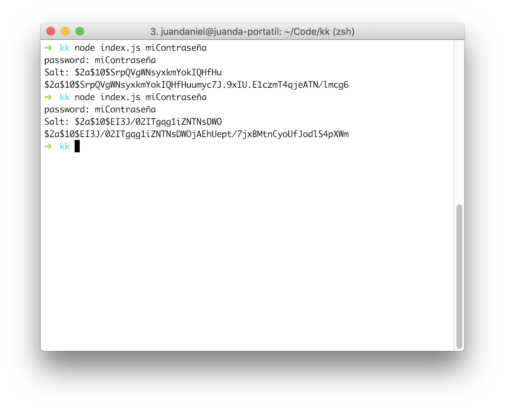

# Autenticación


## Conceptos

- Cuentas de usuario
  - Crear modelo User mediante Mongoose
    - Validaciones
    - Métodos específicos
    - ...
- Hashing
- Creación y envio de tokens mediante **json web tokens** (jwt)


## Documento de usuario

- Nos servirá para construir el modelo
  - Observa que el password lo hasheamos
- Tokens: un array de objetos
  - Token de acceso (puede haber varios: móvil, pc...)
  - Token de resetear password
  - Token de "uso"

```js
{
  email: 'pepe@pepe.com',
  password: 'añdfkjasdñfkljad ñ',
  tokens: [{
    access: 'auth',
    token: 'adfadsfñj3ñjkr3'
  }]
}
```


## Hashing

- El valor de la contraseña se guarda hasheado
- No se puede deshashear:
  - Se genera un checksum o huella digital
  - Es irreversible
    - No es un sistema de encriptación, porque no se puede desencriptar
    - Incluso podría pasar (raro) que dos valores diferentes tuvieran el mismo hash
- Utilizaremos librerías específicas


## Workflow para el login de usuario

- El usuario introduce sus datos (email y contraseña)
- Los datos viajan por la red encriptados (https)
- Proxy inverso, por ej. Apache o Nginx que desencripta los datos y los reenvía al Express
- Express lo recibirá en su ruta de usuarios **POST /users** y lo procesa mediante un controlador


- ¿Existe documento en la colección de Users con ese email?
  - Si:
    - Se hashea la contraseña enviada
    - Se compara con el campo password del documento. ¿Es la misma?
      - Si: se le envia token de tipo auth para sucesivas peticiones
      - No: se envía un código http de error (400)
  - No: Se le envía un código http de error (400 o 404)


## Modelo de usuario

```js
const mongoose = require('mongoose')

var UserSchema = new mongoose.Schema({
  email: {
    type: String,
    required: true,
    trim: true,
    minlength: 1,
    unique: true
  },
  password: {
    type: String,
    require: true,
    minlength: 6
  },
  tokens: [{
    access: {
      type: String,
      required: true
    },
    token: {
      type: String,
      required: true
    }
  }]
})

var User = mongoose.model('User', UserSchema)
module.exports = {User}
```


## Tipos de validación de email

- **El email es correcto** (expresión regular)
- **El email existe**: Servicio de verificación (API)
  - Formato de email, dominio e email válido
    - No todos los clientes SMTP dan respuesta
    - Es necesario guardar una base de datos de emails [¡Y este servicio se paga!](https://hunter.io/pricing)
      - Similar a lo que pasa con un dns inverso
- **El email existe y es propio**: activación de cuenta
  - [Podemos utilizar algún paquete ya preparado](https://www.npmjs.com/package/email-verification)
  - A medida + [nodemailer](https://www.npmjs.com/package/nodemailer)(envio de correos)


## Validaciones personalizadas

- [Ver *custom validators* en la documentación de Mongoose](https://mongoosejs.com/docs/validation.html):

```
var userSchema = new Schema({
  phone: {
    type: String,
    validate: {
      validator: function(v) {
        return /\d{3}-\d{3}-\d{4}/.test(v);
      },
      message: props => `${props.value} is not a valid phone number!`
    },
    required: [true, 'User phone number required']
  }
});
```


## Validar formato email

- Usaremos el [módulo npm validator](https://www.npmjs.com/package/validator)

```js
var UserSchema = new mongoose.Schema({
  email: {
    type: String,
    required: true,
    trim: true,
    minlength: 1,
    unique: true,
    validate: {
      validator: validator.isEmail,
      message: '{VALUE} is not a valid email'
    }
  },
  ...
```


## Ruta para crear usuarios

- Siguiendo reglas API REST

```js
app.post('/users', (req, res) => {
  var body = _.pick(req.body, ['email', 'password'])
  var user = new User(body)

  user.save().then((user) => {
    res.send(user)
  }).catch((e) => {
    res.status(400).send(e)
  })
})
```


- Si todo va bien, se devuelve 201 y el documento creado.
- Puede haber errores: 
  - Falta campo required
  - Longitud mínima password
  - Se devuelve código error http


## jwt y hashing

- Las rutas son públicas
- Algunas queremos hacerlas privadas
  - Solo accederán usuarios autenticados
  - Al autenticarse se obtiene un token
  - El token se envía al querer acceder a la ruta privada


## hashing

- Instalación librería
  
  ```bash
  npm i -S crypto-js
  ```

- Uso librería:
  
```js
const {SHA256} = require('crypto-js')
const password='Esta es mi contraseña'
const hashedPassword = SHA256(password)
console.log(`Password: ${password}`)
console.log(`Hashed Password: ${hashedPassword})
```


## Tokens vs sesiones

- La conexión http no es persistente
  - Uso de sesiones
    - Se guarda el SESSION_ID en cookies
    - Las cookies se mandan de forma automática
  - Uso de tokens
    - Se guardan en *local storage*: envío manual
    - Se guardan en cookies: 
      - Envío automático
      - Problemas en apis multidominio
    - Mayor escalabilidad


- Cada vez que un usuario hace peticiones si está autenticado debe enviar sus datos
  - id de usuario
  - permisos
  - ....

    ```js
    var data = {id: 4}
    ```


- Los datos no se deben modificar (suplatanción de identidad)
- Debemos enviar otra cosa... algo que nos de integridad:

  ```js
  var token = {
    data,
    hash: SHA256(JSON.stringify(data)).toString()
  }
  ```


- El usuario podría cambiar también el hash
  - Necesitamos "sal en el hash"
  - Añadir algún valor aleatorio que solo conozca el generador del hash

  ```json
  var token = {
    data,
    hash: SHA256(JSON.stringify(data) + 'somesecret').toString()
  }
  ```


## Comprobación token

- Nos llega el siguiente token del usuario:

```js
var token = {
  data: {id: 5},
  hash: "añdalñdkfñadj añsdlfgjk añdlk añlfdj dfñjk jjafdkjdfdfk"
}
```

- Comprobamos si es correcto:

```js
var resultHash = SHA256(JSON.stringify(token.data) + 'somesecret').toString()
if (resultHash === token.hash) {
  console.log('Los datos no se han modificado')
} else {
    console.log('Los datos están modificados, no se puede confiar')
}
```


## Manipulación del token

- Generamos el token desde el cliente (no conocemos la sal):

```js
var token = {
  data: {id: 5},
  hash: SHA256(JSON.stringify(token.data)
}
```

- El token no coincidirá porque se desconoce la sal.

```js
var resultHash = SHA256(JSON.stringify(token.data) + 'somesecret').toString()
if (resultHash === token.hash) {
  console.log('Los datos no se han modificado')
} else {
    console.log('Los datos están modificados, no se puede confiar')
}
```


## Estandar JWT

- Token compuesto de:
  - **Header**: algorítmo y tipo de token (jwt en nuestro caso)
  - **Payload**: los datos
  - **Verify Signature**: hash para comprobar integridad
- Existen librerías que lo hacen sencillo
- Se pueden [generar y comprobar online](http://jwt.io)


## Librería jsonwebtoken

- Utilizaremos [jsonwebtoken](https://www.npmjs.com/package/jsonwebtoken)
- Tiene basicamente dos funciones
  - *jwt.sign*: para firmar el token
  - *jwt.verify*: para verificar el token

```js
const jwt = require('jsonwebtoken')
var data = {id: 1}
var token = jwt.sign('data', 'privatePassword')
console.log(token)
var decoded = jwt.verify('token', 'privatePassword')
console.log(decoded)
```

- Si el token ha sido manipulado arrojará un error de **Invalid Signature**.


## Generar token

- Lo haremos en el modelo, al crear el usuario.
  - Seguimos patrón MVC (thin controller, fat model)
  - Reutilización de código
- Definimos un método a nivel de instancia, ¡sin arrow functions! (no acceden a  *this*)

  ```js
  UserSchema.methods.methodName = function () {....}
  ```

  - Si definimos el método a nivel de modelo no podríamos usar this (datos de la instancia)

  ```js
    UserSchema.statics.methodName = function () {....}
  ```


```js
UserSchema.methods.generateAuthToken = function () {
  var user = this
  var access = 'auth'
  var token = jwt.sign({_id: user._id.toHexString(), access}, 'abc123').toString()
  user.tokens.push({access, token}) // si no funciona usar concat
  return user.save().then(() => {
    return token
  })
}
```


## Envío de token al crear usuario

- Lo envíamos como header propio (prefijo x-)

```js
app.post('/users', (req, res) => {
  var body = _.pick(req.body, ['email', 'password'])
  var user = new User(body)

  user.save().then(() => {
    return user.generateAuthToken()
  }).then((token) => {
    res.header('x-auth', token).send(user)
  }).catch((e) => {
    res.status(400).send(e)
  })
})
```


## Workflow de acceso a rutas privadas

- Se solicita un Auth token
- Se valida el token
- Se busca el usuario asociado al token
- Y entonces se accede a la ruta privada


## Convertir ruta pública a privada

- La ruta de signUp o signIn siempre debe ser pública
- Puede haber muchas rutas privadas
  - Usaremos un middleware en dichas rutas para no duplicar código
- Creemos un ejemplo de ruta privada, solicitando el perfil del usuario:

```js
app.get('/users/me', (req, res)=>{
  var token = req.header('x-auth')
  User.findByToken(token).then((user)=>{
    if (!user) {

    }
    res.send(user)
  })
})
```

- Falta implementar el método *findByToken*, encargado de la autenticación
  - Este método podría ser sin base de datos, un simple *jwt.verify*


## Creamos función que haga la autenticación

- En este caso no dependemos de una instancia concreta, haremos un método estático:

11.25, rellenar!! ********************

```js
UserSchema.statics.findByToken = function (token) {
  var User = this
  var decoded

  try {
    decoded = jwt.verify(token, 'abc123')
  } catch (e) {
    return Promise.reject()
  }

  return User.findOne({
    '_id': decoded._id,
    'tokens.token': token,
    'tokens.access': 'auth'
  })
}
```

- El método devuelve una promesa:
  - Puede haber una excepción en jwt.verify
  - En caso de excepción retornaremos Promise.reject()


13.06 *******************

- Vamos a separar la parte de la ruta y lo vamos a hadcer mediante un middleware


## Middleware en un fichero separado

- Adelgazamos nuestro server.js
- Creamos carpeta middlewares
- Creamos fichero authenticate:

  ```js
  var {User} = require('../models/user')

  var authenticate = (req, res, next) => {
    var token = req.header('x-auth')

    User.findByToken(token).then((user) => {
      if (!user) {
        return Promise.reject()
      }
      req.user = user
      req.token = token
      next()
    }).catch((e) => {
      res.status(401).send()
    })
  }

  module.exports = {authenticate}
  ```

## Usar middleware authenticate

- Eliminamos la función authenticate
- Cargamos el módulo authenticate

  ```js
  const {authenticate} = require('./middleware/authenticate')
  app.get('/users/me', authenticate, (req, res)=>{
      res.send(req.user)
    })
  })
  ```


## Hash de la contraseña de usuario

- Ahora el usuario hace un POST /users
  - Envía su contraseña sin encriptar
  - Se guarda como texto plano
- Usaremos el módulo bcrypt
  - Guardaremos la contraseña encriptada
  - Utilizaremos una sal específica para cada encriptación
  
  ```bash
    npm i -S bcryptjs
  ```

- Hay otras librerías basadas en bcrypt, por ej. bcrypt. 
- La que usamos esta toda hecha en js y es más portable, da menos problemas


## Ejemplo encriptación mediante bcrypt

- Se deben ejecutar dos métodos
  - **bcrypt.genSalt** para la generación de la sal
  - **bcrypt.hash** para crear el hash

```js
const bcrypt = require('bcryptjs');
const password = process.argv[2];
console.log(`password: ${password} `);
bcrypt.genSalt(10, (err, salt) => {
  console.log(`Salt: ${salt}`)
  bcrypt.hash(password, salt, (err, hash) => {
      console.log(hash) // esto es lo que queremos guardar en bbdd no el passwd
})
```

## Salida de bcrypt

- Guardamos la sal con la contraseña

  ```bash
  $<algorithm>$<iterations>$<salt>$<hash>
  ```

  - el algoritmo de hash
  - El númer de iteraciones o factor de trabajo
  - La sal aleatoria
  - La contraseña resultante o hash





## Chequeo de contraseña


bcrypt.compare(password, hashedPassword, (err, res)=>{
  // res es true o false
})


## Ejercicio bcrypt

- Utiliza **bcrypt.compara**:
  - Comprueba que devuelve true si el password es correcto
  - Comprueba que devuelve false si el password es erróneo


## Solución ejecicio bcrypt

```js
const bcrypt = require('bcryptjs');
const password = process.argv[2];

hashedPassword='$2a$10$dH5q2dYWbwLMXrPnCMQ52epdQlyvhUqZrUg5iEhXXIkHzPx3G.C/2'
bcrypt.compare(password, hashedPassword, (err, res)=>{
  if (err) console.log(`Error: ${err}`)
  console.log(`El resultado de la comparación es: ${res}`)
})
```


## Mongoose middleware

- Permite ejecutar cierto código antes o después de ciertos eventos
- ¿Para que nos va a servir?
  - Antes de guardar el documento (usuario)
  - Cambiaremos el password por el hash
- [Ver documentación](https://mongoosejs.com/docs/middleware.html)
  - Se pueden ejecutar en serie o en paralelo
  - Podemos utilizar async-await (se verá más adelante)

  ```js
  var schema = new Schema(..);
  schema.pre('save', function(next) {
    // do stuff
    next();
  });
  ```


## Ejercicio implementar middleware

- Implementa middleware según la siguiente funcionalidad:
  - Al guardar un usuario, su contraseña se debe cambiar por el hash
  - Si la contraseña no ha cambiado, no se debe modificar el hash
    - El método save puede llamarse en una actualización por ej.
    - Ayúdate del método isModified que proporciona MongoDB.

  ```js
  UserSchema.pre('save', function (next) {
    var user = this

    if (user.isModified('password')) {
      // user.password

      // user.password = hash
      // next()
    } else {
      next()
    }
  })
  ```

## Solución implementación middleware

```js
UserSchema.pre('save', function (next) {
  var user = this

  if (user.isModified('password')) {
    bcrypt.genSalt(10, (err, salt) => {
      bcrypt.hash(user.password, salt, (err, hash) => {
        user.password = hash
        next()
      })
    })
  } else {
    next()
  }
})
```

- Y probar que funcione :-)